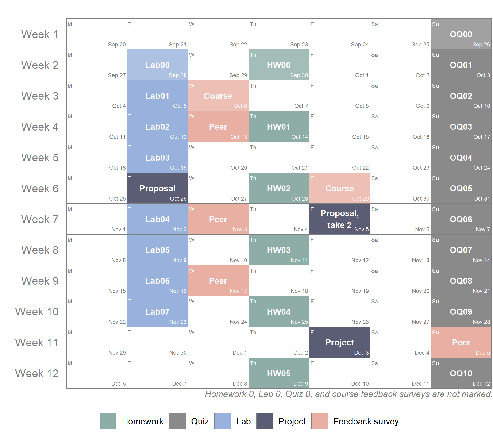

```{r child = "../../setup.Rmd"}
```

```{r packages, echo=FALSE, message=FALSE, warning=FALSE}
library(tidyverse)
library(viridis)
library(sugrrants)
library(lubridate)
```

class: middle

# Course structure

---

## Weekly structure

- **Monday:** Lecture videos for the week released

- **Tuesday and Wednesday:** Student hours with course organisers

- **Thursday:** Code along sessions on Zoom

- **Friday:** Workshops in person (or on Zoom)

- **Sunday:** Weekly quiz due

---

## Lecture videos

- Released on Mondays

- Course content + weekly "State of the IDS"

- Watch (and learn from) them before Friday's workshops

- Sprinkled with application exercises

---

## Student hours

- Starting in Week 2

- One in person and one on Zoom (will not be recorded)

- Come and get real time answers to your questions or just say hi!

---

## Code along sessions

- On Thursdays 10:00am - 11:10am UK time

- On Zoom (will be recorded)

- Live coding session

- Another opportunity to ask questions

- **Tip:** Come tell me what to do!

---

## Workshops / labs

- On Fridays 9:00am-10:20am, 10:30am-11:50am, 2:10pm-3:30pm, or 3:40pm-5pm UK time

- Workshops in person (or on Zoom), attendance is expected

- Work in teams on weekly computing lab exercises during workshop

- Finish outside of workshop and turn in by Tuesday 4pm UK time

- **Tip:** Set up weekly team meetings between Friday and Tuesday

- Lowest score dropped

---

## Homework assignments

- Due on Thursday every other week at 4pm

- Work on them individually

- **Tip:** Do the (optional) R tutorials which will introduce you to the datasets and topics covered in the homework assignments

- Lowest score dropped

---

## Quizzes

- Due on Sundays every week at midnight UK time

- Work on them individually

- 10 multiple choice questions, some requiring a bit of coding, some conceptual

- **Tip:** Don't leave it till the last minute!

- Lowest score dropped

---

## Project

- TL;DR: Find a dataset and do something with it!

- Work in teams

- Proposal, (optional) re-proposal, one-page write up, 5 min presentation

- You must complete the project and participate in the presentation (pre-recorded if remote)

- **Tip:** Stick to optional interim deadlines

---

class: inverse

```{r echo=FALSE}
#here::i_am("week-01/w1-d03-course-information/w1-d03-course-information.Rmd")
#library(here)
#knitr::include_graphics(here("calender.png"))

```

---

## Your final score in the course

- Weights of graded components:
  - Homework: 40%
  - Lab: 10%
  - Project: 30%
  - Quiz: 20%

- Moderation and scaling will follow official University and School policies.<sup>+</sup>

.footnote[
<sup>+</sup> UoE School of Maths course assessment and rules can be found [here](https://teaching.maths.ed.ac.uk/main/undergraduate/studies/assessment/rules).
]

---

class: middle

# Course policies

---

## Zoom expectations

.pull-left-wide[
- When in a large session you should,
  - have your microphone muted by default
  - use the raise your hand feature or type in the chat for questions and comments

- In the small team sessions you should,
  - have your camera turned on as much as possible
  - engage with your team mates via voice and text chat
  - take turns sharing your screen when necessary
]

---

## Collaboration policy

.pull-left-wide[
- Only work that is clearly assigned as team work should be completed collaboratively. 

- Individual assignments must be completed individually, you may not directly share or discuss answers / code with anyone other than the instructors and tutors.

- You are welcome to discuss the problems in general and ask for advice.
]

---

## Sharing / reusing code policy

.pull-left-wide[
- We are aware that a huge volume of code is available on the web, and many tasks may have solutions posted.

- Unless explicitly stated otherwise, this course's policy is that you may make use of any online resources (e.g. Google, StackOverflow, etc.) but you must explicitly cite where you obtained any code you directly use or use as inspiration in your solution(s). 

- Any recycled code that is discovered and is not explicitly cited will be treated as plagiarism, regardless of source.
]

---

## Late work

.pull-left-wide[
- Late work will follow official University and School policies.<sup>+</sup>

- If you intend to submit work late for the project, you must notify the course organizer before the original deadline as well as as soon as the completed work is submitted.
]

.footnote[
<sup>+</sup> UoE School of Maths extensions and late submissions information can be found [here](https://teaching.maths.ed.ac.uk/main/content-to-be-reused/pgt-and-ug-reusable-content/extensions).
]

---

## Regrade requests

.pull-left-wide[
- Must be made within one week of when the assignment is returned and must be submitted to me via email.

- Honoured **only if** points were tallied incorrectly, or if you feel your answer is correct but it was marked wrong. 

- No regrade will be made to alter the number of points deducted for a mistake. 

- There will be no grade changes after the final project presentations.
]

---

## Getting help

.pull-left-wide[
- **Piazza** for course content, logistics, etc. discussion on the course discussion forum

- **Student hours** and **code along** sessions for real-time in person/video chat

- **MathsBase** for drop-in support from a tutor

- **Email** for questions about personal matters (e.g. illness, concessions).

- Most importantly, ask questions!
]

---

## Diversity & inclusion

.pull-left-wide[
- **Intent:** Present materials and activities that are respectful of all axes of diversity.

- Let me know if your preferred name and pronouns.

- Reach out if your performance in the class is being impacted by your experiences outside of class.

- I am always in the process of learning about diverse perspectives and identities. If something was said in class that made you feel uncomfortable, please let me know.
]

---

## Learning during a pandemic

.pull-left-wide[
- We have all had a very tough/different year and things may continue to be a bit different

- I want to make sure that you learn everything you were hoping to learn from this class. If this requires flexibility, please don't hesitate to ask.

- You *never* owe me personal information about your health (mental or physical) but you're always welcome to talk to me. If I can’t help, I likely know someone who can.

- I want you to learn lots of things from this class, but I primarily want you to stay healthy, balanced, and grounded.
]
