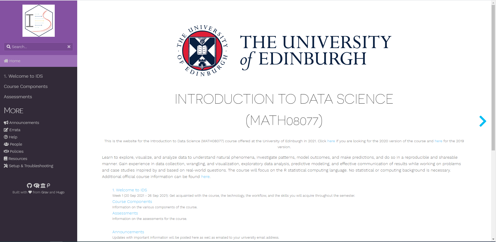
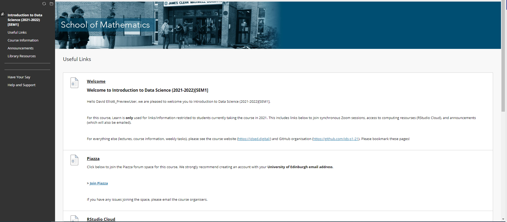
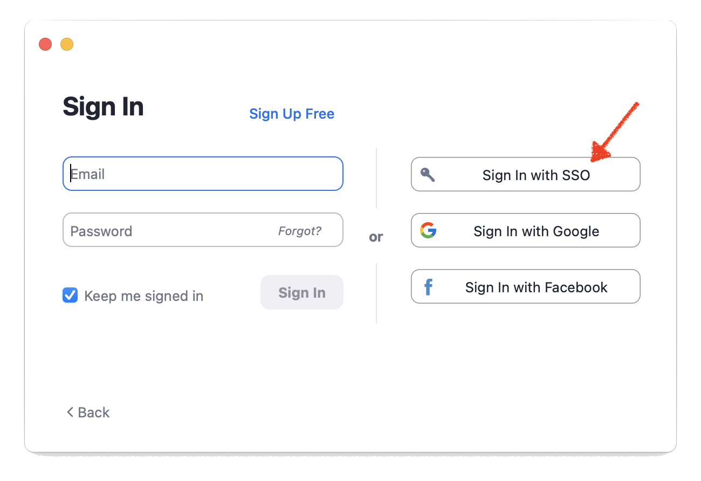

```{r child = "../../setup.Rmd"}
```

```{r packages, echo=FALSE, message=FALSE, warning=FALSE}
library(tidyverse)
library(viridis)
library(sugrrants)
library(lubridate)
```

## Course toolkit

<br>

.pull-left[
### Course operation
- idsed.digital
- Learn
- Zoom
- Piazza
]
.pull-right[
### Doing data science
- Programming:
  - R
  - RStudio
  - tidyverse
  - R Markdown
- Version control and collaboration:
  - Git
  - GitHub
]

---

## Course toolkit

<br>

.pull-left[
### .pink[Course operation]
- .pink[idsed.digital]
- .pink[Learn]
- .pink[Zoom]
- .pink[Piazza]
]
.pull-right[
### .gray[Doing data science]
.gray[
- Programming:
  - R
  - RStudio
  - tidyverse
  - R Markdown
- Version control and collaboration:
  - Git
  - GitHub
]
]

---

## idsed.digital

```{r echo=FALSE, out.width="90%"}

```

---

## Learn

- University's official course management system
- Go here for:
  - past announcements
  - course marks
  - links to join Piazza, RStudio Cloud, and Zoom
  
```{r echo=FALSE, out.width="65%"}

```

---

## Zoom

- Video calls for student hours, code along sessions, workshops
- Strongly recommend using the app (vs the web interface)
- Use your University of Edinburgh provided account
(sign in using the SSO option with `ed-ac-uk` domain)

.pull-left[
```{r echo=FALSE, out.width="90%"}

```
]
.pull-right[
```{r echo=FALSE, out.width="90%"}

```
]

---

## Piazza

- For all course content related questions
- Ask **and** answer
  - Piazza awards at the end of the semester!
- Before posting, check questions that have already been asked

---

## Most importantly...

- Stay engaged

- Participate

- Ask questions
