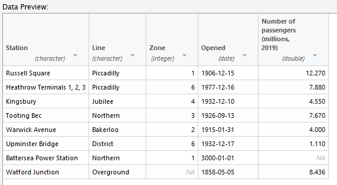

```{r child = "../../setup.Rmd"}
```

```{r packages, echo=FALSE, message=FALSE, warning=FALSE}
library(tidyverse)
library(emo)
```
---

## What's a GUI?

- "Graphical User Interface"

- We've been using one already!

---

class: middle

# CSV files

---

## Importing data

- We've talked about the `read_csv` function

- The options are a little bit fiddly

  - Especially for wide datasets
  
- You have to inspect the dataset manually to get it right

---
## Tube stations data

```{r read-csv, echo = T}
tube <- read_csv("data/tube-stations.csv")
```

--

Well, this doesn't seem to have worked!  Let's look at the dataset…

---
## Tube stations data

```{r show-data, echo = T}
tube
```
- The separators are semicolons, not commas!
- So we could use `read_csv2` - but we have to remember that!
- Is there an easier way?
---
class: inverse
background-image: url("img/From-text-readr.png")

## The "Import Dataset" menu

Several options!  Choose **From Text (readr)...**.

---
class: inverse
background-image: url("img/Import-box.png")
background-size: contain

---
class: inverse
background-image: url("img/Preview-1.png")
background-size: contain
---
class: inverse
background-image: url("img/Preview-2.png")
background-size: contain
---

## Choosing a data type

.pull-left[
.center[]
]

--

.pull-right[
.center[]
]

---
class: inverse
background-image: url("img/date-1.png")

## Date formats
The default isn't right!

---
class: inverse
background-image: url("img/date-2.png")

## Date formats
Our dates are of the form `01-JAN-1900`, so we need to type `%d-%b-%Y` into the box. 

Type `?col_date` into the console for more info on the syntax.

---
class: inverse
background-image: url("img/Preview-3.png")
background-size: contain
---
## Importing from a CSV using the GUI

.center[]

- All the data types are correct
- Note the non-integer Zone has become an `NA` …
- … but not all NAs have been removed!
---
## Importing from a CSV using the GUI

.center[]

- We can run the code directly from the dialog box, but that won't help with reproducibility/portability of the code
- Instead, click the clipboard button

---
## Importing from a CSV using the GUI

```{r csv-data-import, echo = T}
#library(readr)
tube_stations <- read_delim("data/tube-stations.csv", 
    delim = ";", escape_double = FALSE, col_types = cols(Zone = col_integer(), 
        Opened = col_date(format = "%d-%b-%Y")), 
    trim_ws = TRUE)
```
It gives us the `readr` library, but if we've already imported the tidyverse we don't need to include that line, and can delete it.

The warning message here is fine---it's telling us that "`not in a zone`" is not an integer, which we already know!
---

## Importing from a CSV using the GUI

Let's prove it worked!


```{r csv-summary, echo =T}
tube_stations %>%
  summarise(mean_date = mean(Opened), med_zone = median(Zone, na.rm = T))
```

- The mean date is in the future because we haven't removed that Year 3000 date yet…
---

class: middle

# Excel files
---
## Our data in an Excel file


.center[]

The same data (except for Watford Junction)
---
class: inverse
background-image: url("img/From-text-readr.png")

## The "Import Dataset" menu

Now we want **From Excel...**.

---
class: inverse
background-image: url("img/Import-box-xl.png")
background-size: contain

---
class: inverse
background-image: url("img/Preview-xl.png")
background-size: contain
---

## Importing from Excel using the GUI

.center[]

- We need to specify the range of cells in which the data are stored (or use the **Skip:** field)
- The **Name:** field is the name under which we'll store the data once imported
  - Choose something different to avoid overwriting!

---

## Importing from Excel using the GUI

.center[]

- We don't get separate **double** and **integer** options here: all we can choose is **numeric** (we can fix that later)
- Dates are handled easily, because of the way they're stored in Excel

---

## Importing from Excel using the GUI

.center[]

- Again, let's copy this out using the clipboard icon…

```{r excel-code, echo = T, warning = F}
library(readxl)
tube_stations_excel <- read_excel("data/tube-stations.xlsx", 
    range = "A3:E10", col_types = c("text", 
        "text", "numeric", "date", "numeric"))
```
- I've suppressed the warnings (`warning = F` in the code chunk label) because it gives lots, for every time it changes the data type in a cell


